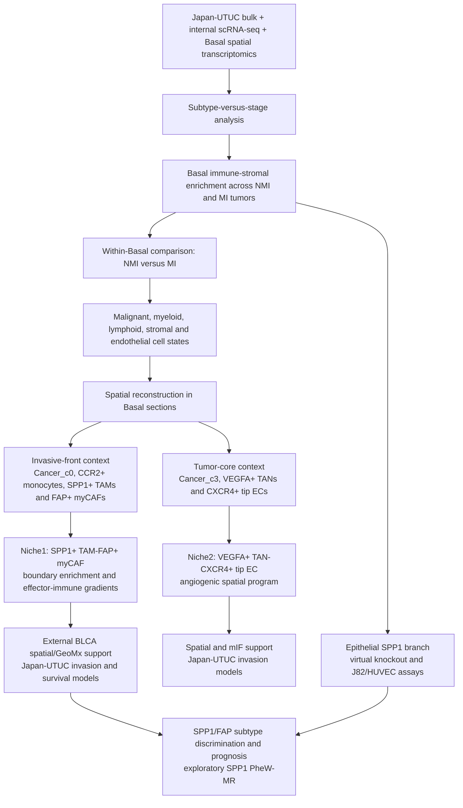

# Basal UTUC spatial ecosystems

Analysis code accompanying the manuscript:

> **SPP1-associated spatial ecosystem remodeling in Basal upper tract
> urothelial carcinoma**

The repository is organized by analysis layer and by final figure. It contains
the main processing workflows, shared R/Python functions, figure input
contracts and plotting scripts. Patient-level raw data, large intermediate
objects and histology images are kept outside the repository.

## Repository map

```text
Basal-UTUC-spatial-ecosystems/
├── core/
│   ├── R/                         shared R functions
│   └── python/                    shared Python functions
├── workflows/
│   ├── single_cell/               scRNA-seq processing and cell-state analyses
│   ├── spatial/                   spatial mapping, co-localization and boundaries
│   ├── genetics/                  scPagwas and SPP1 PheW-MR
│   └── bulk_clinical_validation/  subtype, deconvolution and clinical models
├── figures/Fig01-Fig11/           main-figure modules
├── supplementary/SuppFig01-SuppFig14/
│                                    supplementary-figure modules
├── config/                        analysis parameters and path templates
├── manifests/                     figure, method, function and data indexes
├── tests/                         syntax, parameter and privacy checks
└── data/README.md                 expected local inputs
```

## Study design and code map

The analysis separates two questions that should not be conflated: whether the
UTUC microenvironment is organized mainly by molecular subtype or pathological
stage, and which cellular and spatial changes accompany progression from
NMI-Basal to MI-Basal disease.



Niche1 and Niche2 are analyzed as parallel MI-associated programs. Niche1
shows the more reproducible tumor-boundary organization and retains the
stage-adjusted disease-specific survival association in the Japan-UTUC cohort;
Niche2 supports a hypoxia/angiogenesis program but has a more heterogeneous
spatial pattern. The epithelial SPP1 perturbation is a separate functional
branch and is not used as proof of TAM-derived SPP1 signaling to fibroblasts.
Japan-UTUC provides bulk clinical validation, not spatial validation.

## Main-figure modules

| Figures | Analysis covered |
|---|---|
| [Fig. 1](figures/Fig01) | Molecular subtype, stage, bulk TME scores and major single-cell compartments |
| [Fig. 2](figures/Fig02) | Basal spatial transcriptomics and IHC across stages |
| [Fig. 3](figures/Fig03) | Myeloid states, trajectories and spatial remodeling |
| [Fig. 4](figures/Fig04) | Fibroblast and endothelial states |
| [Fig. 5](figures/Fig05) and [Fig. 6](figures/Fig06) | Cell communication and spatial organization of the SPP1+ TAM–FAP+ myCAF program |
| [Fig. 7](figures/Fig07) | External bladder cancer spatial, GeoMx and paired-Visium support |
| [Fig. 8](figures/Fig08) | Malignant-epithelial SPP1 perturbation and experimental panels |
| [Fig. 9](figures/Fig09) | VEGFA+ TAN–CXCR4+ tip-EC angiogenic program |
| [Fig. 10](figures/Fig10) | Multiscale spatial comparison and Japan-UTUC clinical models |
| [Fig. 11](figures/Fig11) | SPP1/FAP subtype classification and prognosis |

Each figure directory contains a panel-to-code table, the expected input
columns, plotting instructions, figure-specific configuration and a list of
outputs. The complete panel index, including Supplementary Figs. S1–S14, is in
[`manifests/figure_manifest.tsv`](manifests/figure_manifest.tsv).

## Analysis indexes

- [`workflows/00_pipeline_overview.R`](workflows/00_pipeline_overview.R):
  ordered list of workflow and figure hand-offs.
- [`manifests/manuscript_method_audit.tsv`](manifests/manuscript_method_audit.tsv):
  mapping from Methods sections to repository scripts.
- [`manifests/function_catalog.tsv`](manifests/function_catalog.tsv): shared R
  and Python functions written for this project.
- [`manifests/data_manifest.tsv`](manifests/data_manifest.tsv): data sources,
  accessions and expected local filenames.
- [`config/parameters.yaml`](config/parameters.yaml): parameters shared across
  workflows.
- [`DEPENDENCIES.md`](DEPENDENCIES.md): packages, command-line tools and
  external databases.

All analysis scripts use the same command-line arguments:

```text
--config --input-dir --output-dir --seed --threads
```

Run metadata include the random seed, software version, UTC time and Git
commit.

## Quick start

```bash
cp config/project.example.yaml config/project.yaml
conda env create -f environment.yml
conda activate basal-utuc-spatial
bash tests/run_all.sh
```

Example for Fig. 10:

```bash
Rscript figures/Fig10/01_analysis.R \
  --config figures/Fig10/config.yaml \
  --input-dir data/processed/Fig10 \
  --output-dir outputs/Fig10 \
  --seed 20260730 --threads 4

Rscript figures/Fig10/02_plot.R \
  --config figures/Fig10/config.yaml \
  --input-dir outputs/Fig10 \
  --output-dir outputs/Fig10 \
  --seed 20260730 --threads 4
```

## Data and code availability

FASTQ/BAM files, patient-level clinical records, RDS/H5AD/loom objects,
Visium histology images, model weights and local workstation/server paths are
not included. Public datasets should be downloaded from their original
repositories; filenames and input schemas are listed in
[`data/README.md`](data/README.md) and
[`manifests/data_manifest.tsv`](manifests/data_manifest.tsv).

No open-source licence is granted. Copyright © 2026 Qi Zhang and co-authors.
Third-party packages remain under their own licences and are not copied into
this repository.
